# 🍵 Aromê

<p>Aromê é um e-commerce especializado na venda de chás, infusões e utensílios relacionados, com a opção de um clube de assinatura exclusivo para os amantes de chá.

🚧 Status: Projeto em desenvolvimento...
<br/>
🔗 <a href='https://arome.vercel.app/'>Acesso a demo</a></p> 

## 💡 Objetivo

<p>Estou programando este e-commerce com base em um <a href='https://www.figma.com/file/f3fkNm6wy74DNAVnucpb6TUD/site-arome?type=design&node-id=0%3A1&mode=design&t=HVve7kprLR3uc6fX-1'>projeto Figma</a>, com o objetivo de aplicar e expandir meus conhecimentos em frontend e backend. Esse trabalho me permite desenvolver uma solução fullstack completa, aprimorando minhas habilidades em todas as etapas da construção de uma plataforma.</p>


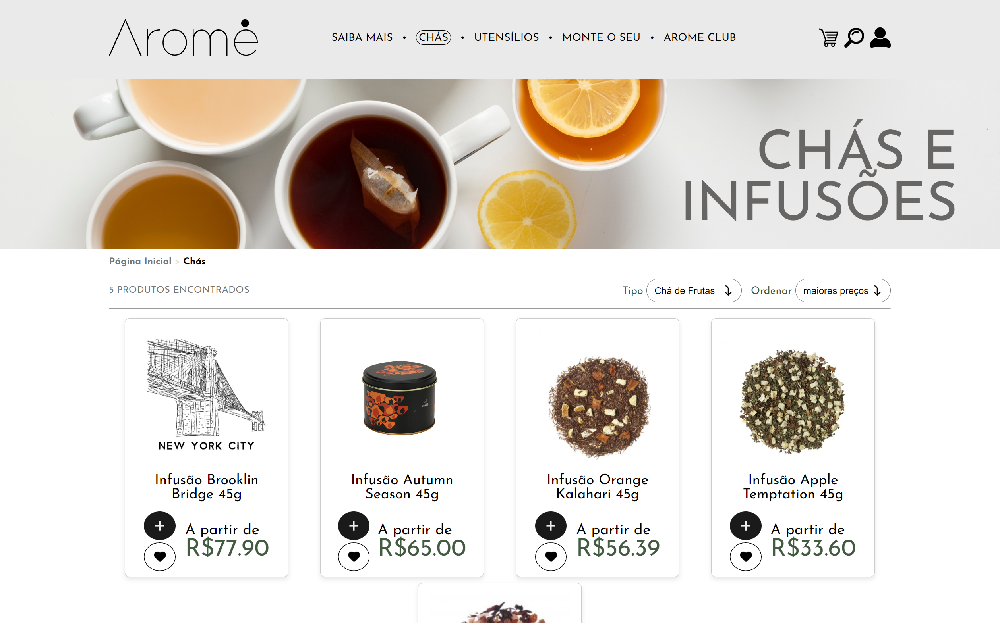
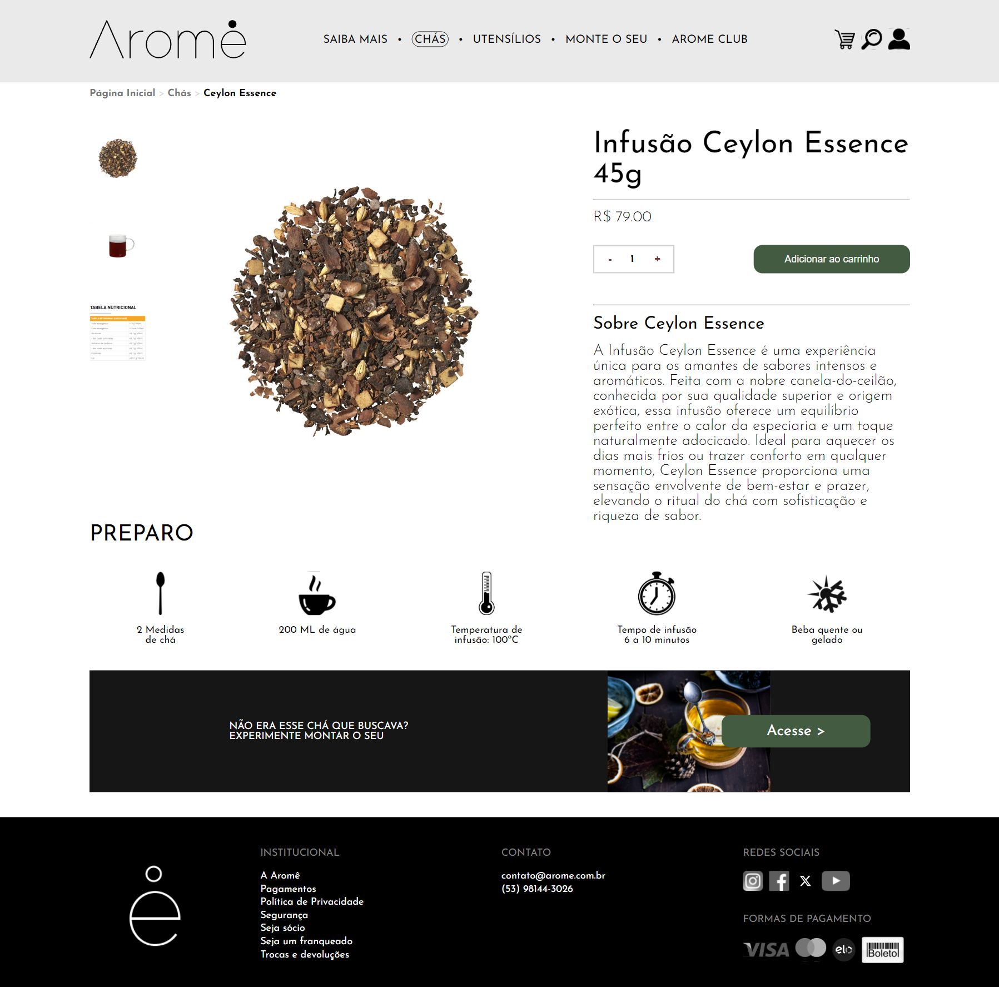

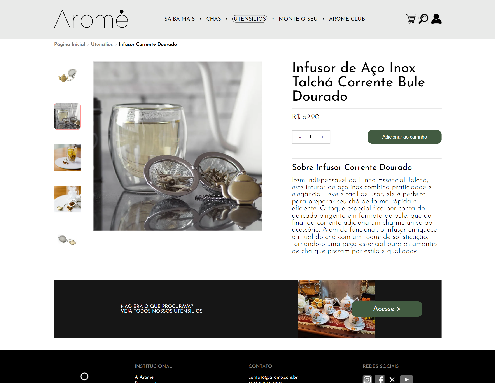

# 🧱 Estrutura dos arquivos e Tecnologias empregadas 🔧 

<p>Eu dividi o meu projeto em duas pastas principais: uma para o <strong>frontend</strong> e outra para o <strong>backend</strong>.</p>

# Frontend:

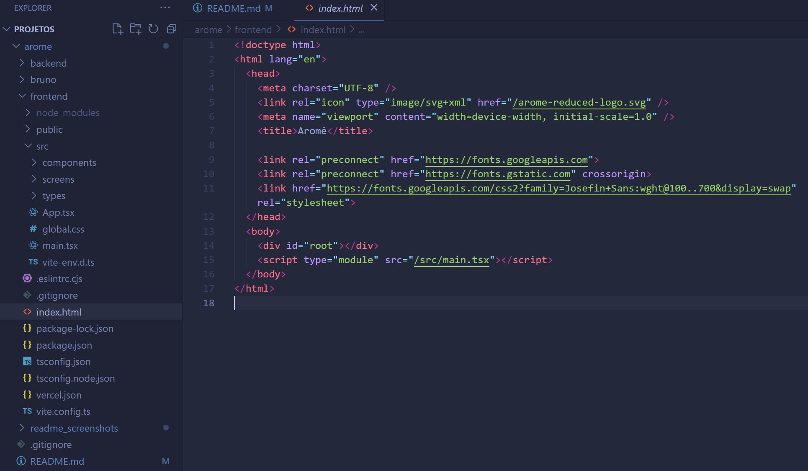

## ⚡️ Vite e React.JS ⚛️

<p>Utilizei o Vite junto do React no meu projeto para otimizar o processo de desenvolvimento, aproveitando sua eficiência e inicialização extremamente rápida.</p>
<p>Com o React, tenho o benefício da componentização, o que me permite reutilizar partes já programadas e realizar a manutenção do código de forma mais prática e eficiente.</p>
</br>
<p>A aplicação React inicializa no arquivo <strong>main.tsx</strong>, renderizando o componente raiz e configurando a aplicação.</p>

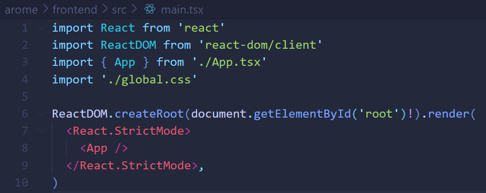

<p>Ainda nesse arquivo temos a importação de um arquivo CSS para estilização global da aplicação.</p>
<p>O <stong>global.css</strong>:</p>

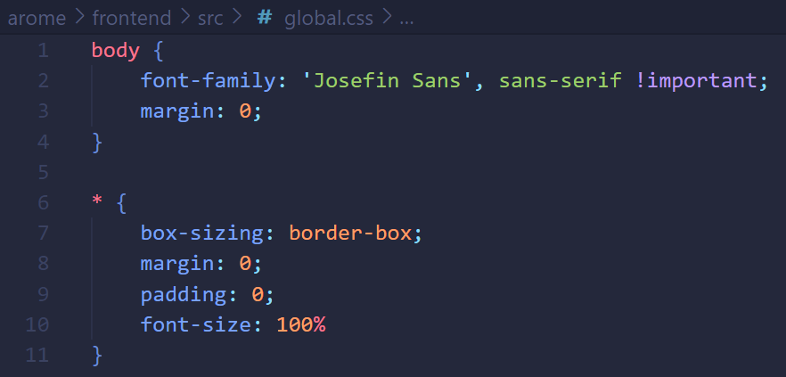

<p>Nesse CSS está definido a fonte de todo o e-commerce e um <strong>Reset CSS</strong>, que nada mais é do que uma técnica ou conjunto de estilos CSS projetados para normalizar o estilo padrão dos elementos HTML em todos os navegadores da web.</p>

## 🛣️ react-router-dom

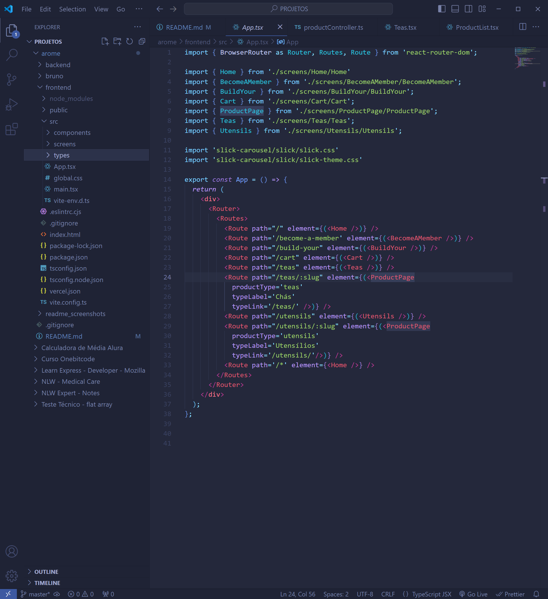

<p>O componente raíz da aplicação React é o <strong>App.tsx</strong>.</p>
<p>Nele configurei todas as rotas do frontend através da biblioteca <strong>react-router-dom</strong>, onde cada rota renderiza uma 'screen' diferente.</p>

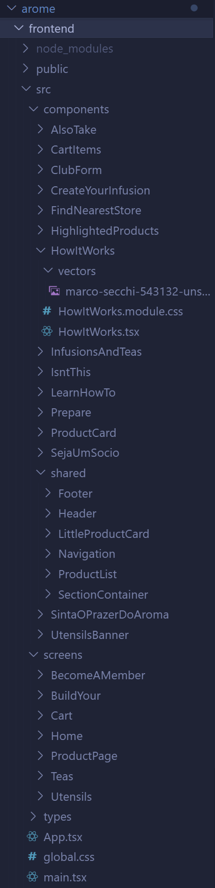

<p>Organizei o frontend em pastas específicas para <strong>telas</strong> e <strong>componentes</strong>. Dentro da pasta de componentes, há uma subpasta <strong>shared</strong>, onde armazenei componentes reutilizáveis em várias telas.</p>
<p>Cada componente possui um arquivo <strong>.tsx</strong>, um arquivo <strong>.module.css</strong>, e, quando necessário, uma pasta <strong>vectors</strong> para os vetores ou imagens.</p>
<p>As telas são compostas por diversos componentes, com o <strong>Header</strong> e o <strong>Footer</strong> sempre posicionados como o primeiro e o último elementos, respectivamente.</p>

## 💻 Typescript

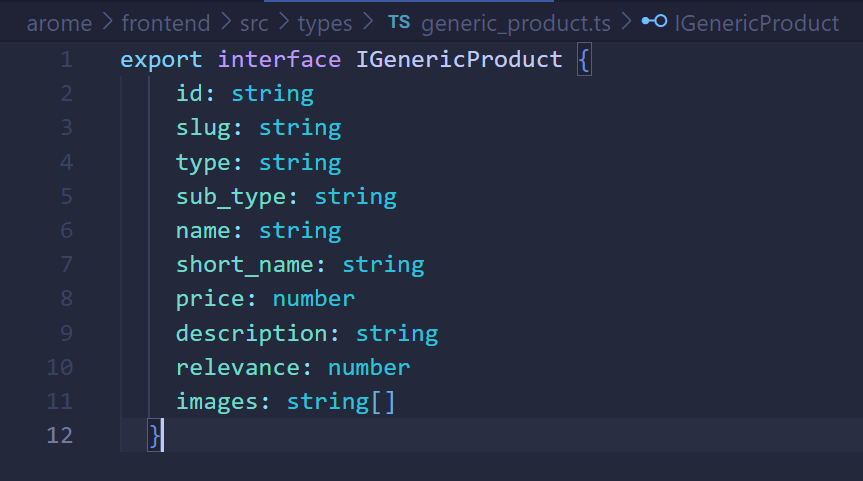
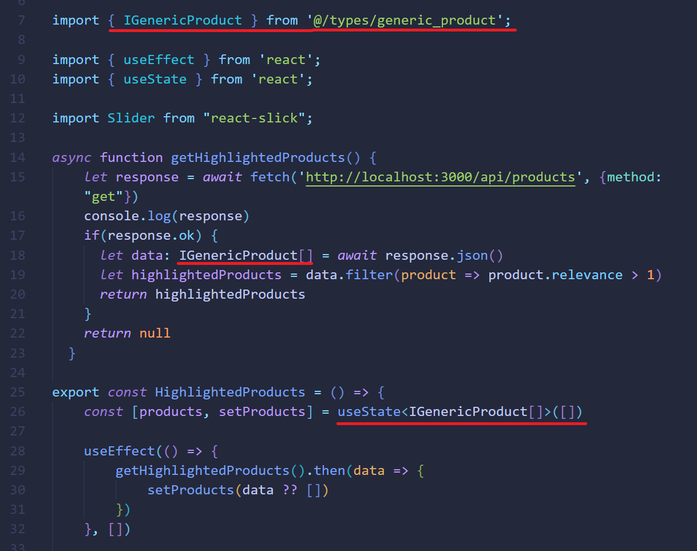

<p>Escolhi usar TypeScript no projeto porque ele ajuda a evitar erros, mostrando problemas no código enquanto estou programando. Além disso, a tipagem torna o desenvolvimento mais organizado e facilita a manutenção do projeto no futuro. Ele também melhora o autocompletar, o que acelera o trabalho e torna o código mais claro e fácil de entender.</p>


## 🎠 react-slick

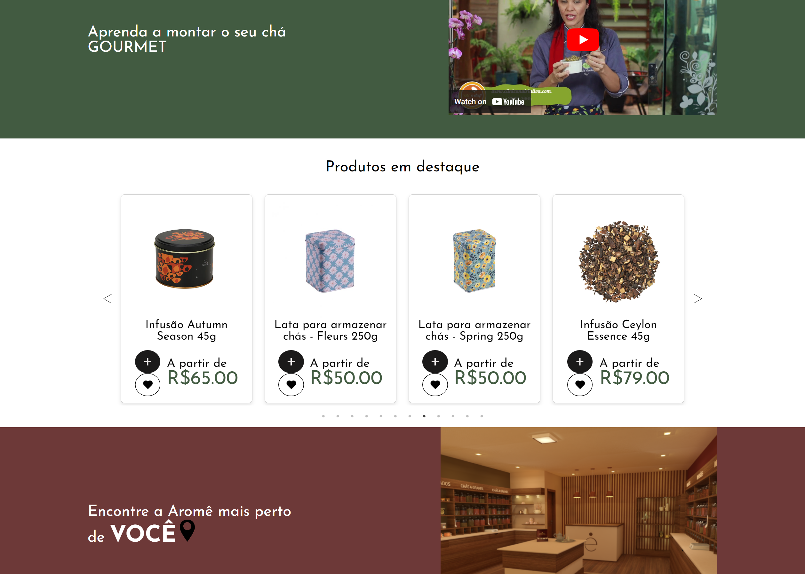


<p>Com a biblioteca <strong>react-slick</strong> montei o carrossel de produtos em destaque.</p>

## 📋 react-hook-form com zod e zod resolver

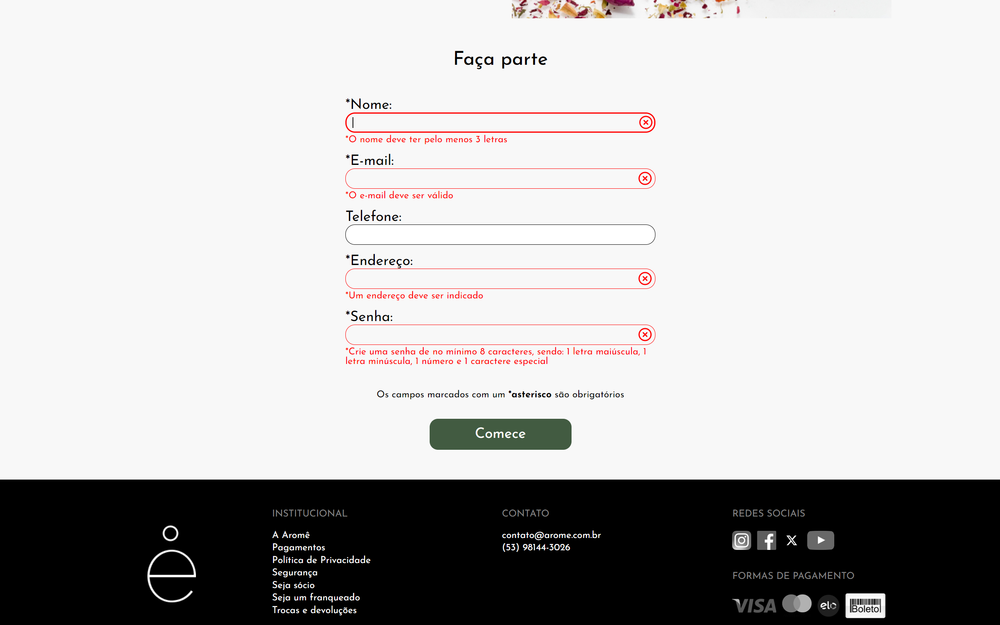

<p>Fiz o formulário de inscrição no club de assinatura utilizando <strong>react-hook-form</strong> e fiz a validação com <strong>zod</strong> e <strong>zod resolver</strong>.</p>

## 🎨 CSS Modules

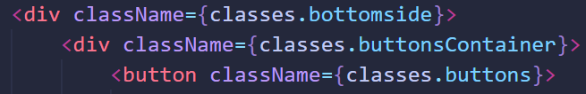

<p>Todo o estilo do site é feito utilizando 'módulos CSS', que ajudam a evitar conflitos de estilos e facilitam a manutenção do código.</p>

# Backend:

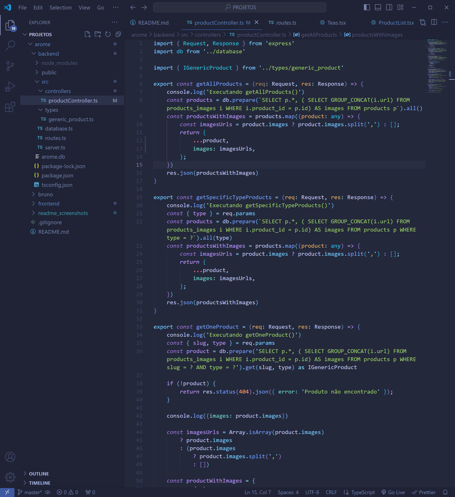

<p>No <strong>backend</strong>, utilizei um banco de dados do tipo SQLite chamado <strong>arome.db</strong> e a seguinte estrutura de arquivos dentro da pasta <strong>src</strong>:</p> 
<ul> 
    <li><strong>server.ts</strong>: Arquivo responsável pela configuração e inicialização do servidor backend da Aromê, onde são definidas as configurações principais, como middleware, rotas e a conexão com o banco de dados, assegurando que a aplicação esteja pronta para atender às requisições dos usuários.</li> 
    <li><strong>routes.ts</strong>: Neste arquivo, estão configuradas todas as rotas disponíveis para o backend, definindo as requisições HTTP que o servidor irá responder e as respectivas funções a serem executadas em cada uma delas. Isso garante uma estrutura organizada e fácil de manter para a manipulação de dados e interações com o cliente.</li> 
    <li><strong>database.ts</strong>: Arquivo responsável pela configuração da conexão com o banco de dados SQLite, gerenciando as operações de leitura e escrita e garantindo a integridade dos dados armazenados.</li> <li><strong>productController.ts</strong>: Contém as funções que lidam com a lógica de negócios relacionada aos produtos, como a criação, atualização, deleção e recuperação de informações, servindo como intermediário entre as rotas e o banco de dados.</li> 
</ul>


## 📚 Como usar

```
# Entre na pasta do projeto através de um console e digite o seguinte comando

$ npm run dev

ou

$ yarn dev

# O servidor irá iniciar na porta 5173
```

<hr>

<p align="center"><strong>Feito por </strong><a href='https://www.linkedin.com/in/tierres-griep-23131621a/'>Tierres Griep</a></p>
