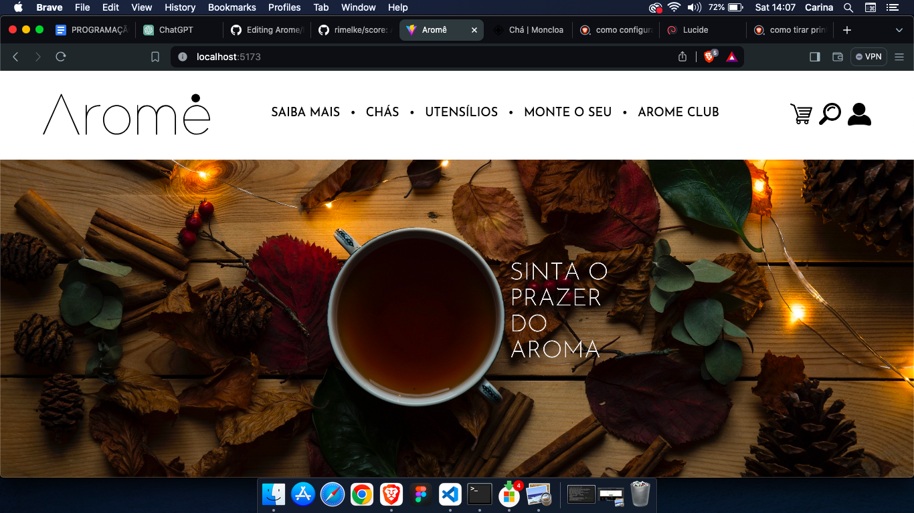
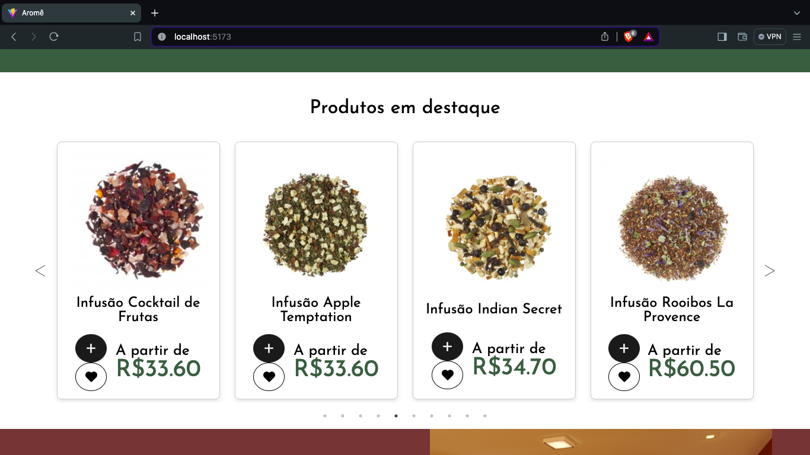
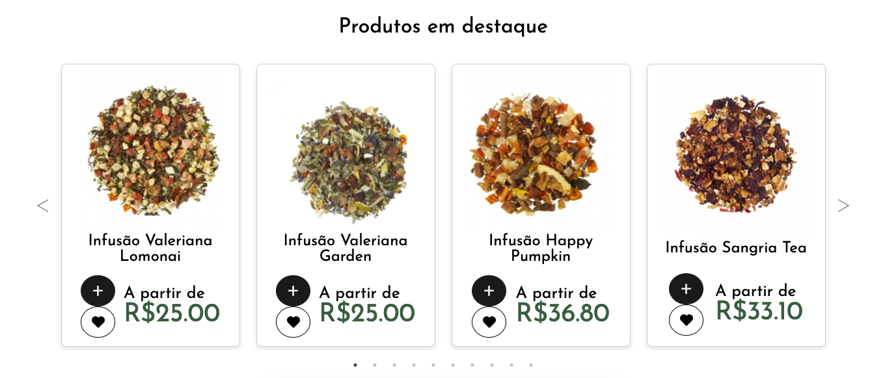

# 🍵 Aromê

Um E-commerce de uma franquia focada em vender chás e infusões. <a href=''>Acesse a demo.</a> - em desenvolvimento... 🚧
 

## 💡 Objetivo

Esse E-commerce está sendo produzido através desse <a href='https://www.figma.com/file/f3fkNm6wy74DNAVnucpb6TUD/site-arome?type=design&node-id=0%3A1&mode=design&t=HVve7kprLR3uc6fX-1'>projeto figma.</a> É o meu primeiro projeto grande e estou aprendendo diversas tecnologias desenvolvendo ele.

 
## 🔧 Tecnologias empregadas
### 💻 Website

<ul>
 <li>Vite</li>
 <li>React</li>
</ul>

 
 

## 🚧 Status do projeto
### Frontend: Em desenvolvimento...
### Backend: ...
