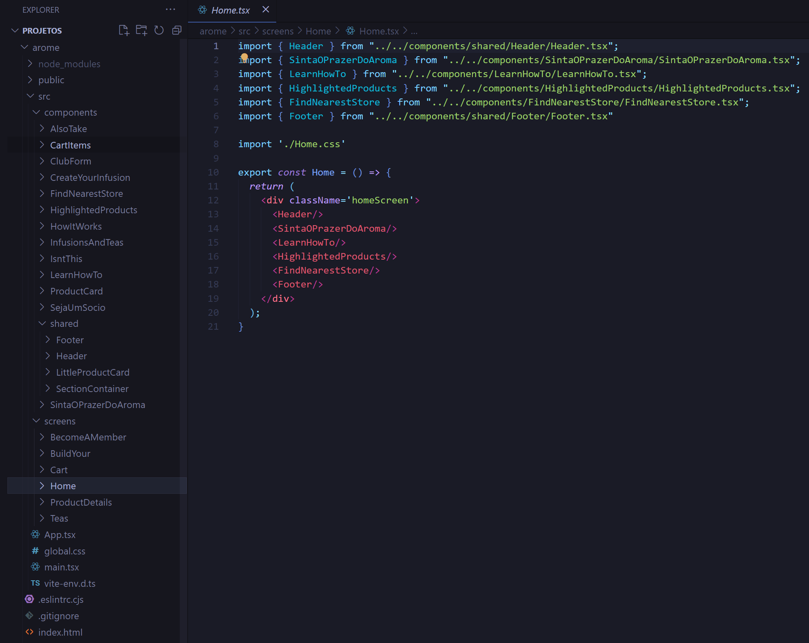

# 🍵 Aromê

<p>Um E-commerce de uma franquia focada em vender chás e infusões. <a href='https://arome.vercel.app/'>- Acesse a demo.</a> - projeto em desenvolvimento... 🚧</p> 

## 💡 Objetivo

<p>Esse E-commerce está sendo produzido através desse <a href='https://www.figma.com/file/f3fkNm6wy74DNAVnucpb6TUD/site-arome?type=design&node-id=0%3A1&mode=design&t=HVve7kprLR3uc6fX-1'>projeto figma.</a> É o meu primeiro projeto grande e estou aprendendo diversas tecnologias desenvolvendo ele.</p>


 
## 🔧 Tecnologias empregadas
### 💻 Website

<ul>
 <li>Vite</li>
 <li>React</li>
</ul>


## 🎠 react-slick

<p>Utilizei a biblioteca <strong>react-slick</strong> para fazer o carrossel de produtos em destaque.</p>


## 📋 react-hook-form com zod e zod resolver

<p>Fiz o formulário de inscrição no club utilizando <strong>react-hook-form</strong> e fiz a validação com <strong>zod</strong> e <strong>zod resolver</strong>.</p>





## 🧱 Estrutura dos arquivos
<p>O meu projeto consta com duas pastas principais: de <strong>componentes</strong> e de <strong>telas</strong>.</p>
<p>Cada tela é composta por diversos componentes, sendo o <strong>Header</strong> e o <strong>Footer</strong> sempre o primeiro e o último, respectivamente.</p>

## 🎨 CSS Modules
<p>Todo o estilo do site é feito utilizando 'módulos CSS', que ajudam a evitar conflitos de estilos e facilitam a manutenção do código.</p>

## 🚧 Status do projeto
### Frontend: Em desenvolvimento...
### Backend: ...

## 📚 Como usar

```
# Entre na pasta do projeto através de um console e digite o seguinte comando

$ npm run dev

ou

$ yarn dev

# O servidor irá iniciar na porta 5173
```

<hr>

<p align="center"><strong>Feito por </strong><a href='https://www.linkedin.com/in/tierres-griep-23131621a/'>Tierres Griep</a></p>
