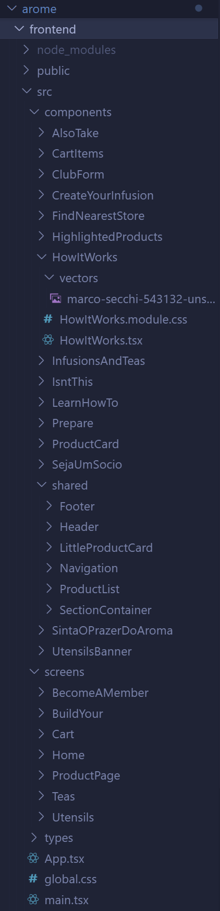

# 🍵 Aromê

<p>Aromê é um e-commerce especializado na venda de chás, infusões e utensílios relacionados, com a opção de um clube de assinatura exclusivo para os amantes de chá.

🚧 Status: Projeto em desenvolvimento...
<br/>
🔗 <a href='https://arome.vercel.app/'>Acesso a demo</a></p> 

## 💡 Objetivo

<p>Estou programando este e-commerce com base em um <a href='https://www.figma.com/file/f3fkNm6wy74DNAVnucpb6TUD/site-arome?type=design&node-id=0%3A1&mode=design&t=HVve7kprLR3uc6fX-1'>projeto Figma</a>, com o objetivo de aplicar e expandir meus conhecimentos em frontend e backend. Esse trabalho me permite desenvolver uma solução fullstack completa, aprimorando minhas habilidades em todas as etapas da construção de uma plataforma.</p>


 
# 🔧 Tecnologias empregadas
## 💻 Vite e React.JS

<p>Utilizei o Vite junto do React no meu projeto para otimizar o processo de desenvolvimento, aproveitando sua eficiência e inicialização extremamente rápida.</p>
<p>Com o React, tenho o benefício da componentização, o que me permite reutilizar partes já programadas e realizar a manutenção do código de forma mais prática e eficiente.</p>

## 🎠 react-slick


<p>Com a biblioteca <strong>react-slick</strong> montei o carrossel de produtos em destaque.</p>


## 📋 react-hook-form com zod e zod resolver


<p>Fiz o formulário de inscrição no club de assinatura utilizando <strong>react-hook-form</strong> e fiz a validação com <strong>zod</strong> e <strong>zod resolver</strong>.</p>


## 🧱 Estrutura dos arquivos

<p>O meu projeto é divido em duas pastas principais: <strong>backend</strong> e <strong>frontend</strong>.</p>

### Frontend:



<p>No <strong>frontend</strong>, organizei o projeto em pastas específicas para <strong>telas</strong> e <strong>componentes</strong>. Dentro da pasta de componentes, há uma subpasta <strong>shared</strong>, onde armazenei componentes reutilizáveis em várias telas.</p>
<p>Cada componente possui um arquivo <strong>.tsx</strong>, um arquivo <strong>.module.css</strong>, e, quando necessário, uma pasta <strong>vectors</strong> para os vetores ou imagens.</p>
<p>As telas são compostas por diversos componentes, com o <strong>Header</strong> e o <strong>Footer</strong> sempre posicionados como o primeiro e o último elementos, respectivamente.</p>

### Backend:


## 🎨 CSS Modules
<p>Todo o estilo do site é feito utilizando 'módulos CSS', que ajudam a evitar conflitos de estilos e facilitam a manutenção do código.</p>

## 🚧 Status do projeto
### Frontend: Em desenvolvimento...
### Backend: Em desenvolvimento...

## 📚 Como usar

```
# Entre na pasta do projeto através de um console e digite o seguinte comando

$ npm run dev

ou

$ yarn dev

# O servidor irá iniciar na porta 5173
```

<hr>

<p align="center"><strong>Feito por </strong><a href='https://www.linkedin.com/in/tierres-griep-23131621a/'>Tierres Griep</a></p>
